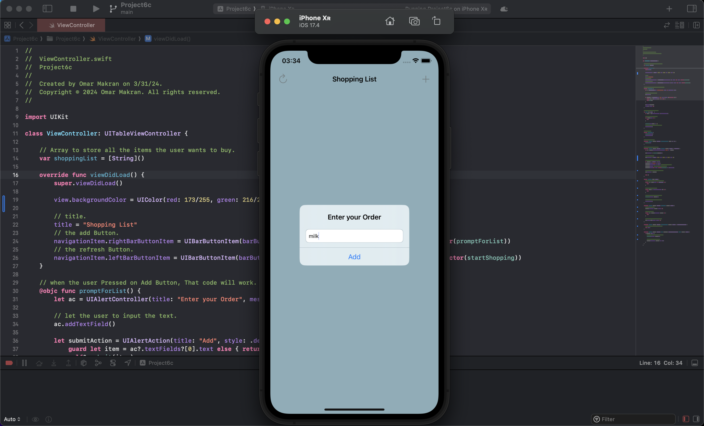
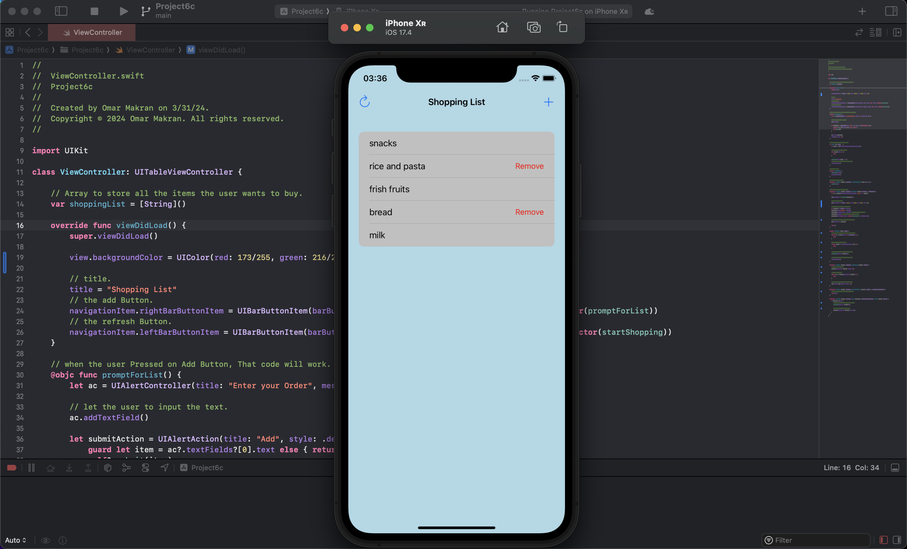

# UIKit

# Challenge
It’s time to put your skills to the test by making your own complete app from scratch. This time your job is to create an app that lets people create a shopping list by adding items to a table view.

The best way to tackle this app is to think about how you build project 5: it was a table view that showed items from an array, and we used a UIAlertController with a text field to let users enter free text that got appended to the array. That forms the foundation of this app, except this time you don’t need to validate items that get added – if users enter some text, assume it’s a real product and add it to their list.

For bonus points, add a left bar button item that clears the shopping list – what method should be used afterwards to make the table view reload all its data?

### Challenge is done:

# Day 32

